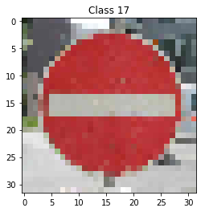

# **Traffic Sign Recognition** 

## Writeup

---

**Build a Traffic Sign Recognition Project**

The goals / steps of this project are the following:
* Load the data set (see below for links to the project data set)
* Explore, summarize and visualize the data set
* Design, train and test a model architecture
* Use the model to make predictions on new images
* Analyze the softmax probabilities of the new images
* Summarize the results with a written report

---
### Writeup / README

### Data Set Summary & Exploration

#### 1. In The first step I read the data and do a short summary to see how the data is split into the training / validation / test sets and also to examine the distribution of the examples to see if all the traffic signs are covered with a similar number of samples/

Following number of examples is available in the set:

* The size of training set is 34799
* The size of the validation set is 4410
* The size of test set is 12630
* The shape of a traffic sign image is (32, 32, 3)
* The number of unique classes/labels in the data set is 43

#### 2. Include an exploratory visualization of the dataset.

Below a plot is showing how the dataset is splitted into subsets:

Here is an exploratory visualization of the data set. It is a bar chart showing how the data in each subset is splitted, what means how many samples of each traffic sign are available in each set.

It can be seen that for some of the traffic signs there are much more examples available than for the other ones. That might have a huge impact on the training of the net.

### Design and Test a Model Architecture

#### 1. Preprocessing of the input images

As a first step in preprocessing I decided to normalize all the images to the range 0..1 by dividing all the pixels values by 255 and converting to float.

I decided to leave the images in rgb colorspace as I think that in case of traffic signs a color gives an important input to the net.

#### 2. Description of a final architecture of the net

My Net model is based on the original LeNet designed by Ian LeCun but I introduced some changes in order to increase the learning capability of the model.

| Layer         		|    Description	        					| 
|:---------------------:|:---------------------------------------------:| 
| Input         		| 32x32x3 RGB image   							| 
| Convolution 5x5    	| 1x1 stride, valid padding, outputs 28x28x10 	|
| RELU					|												|
| Max pooling	      	| 2x2 stride,  outputs 16x16x10 				|
| Dropout 	  	 	  	| 												|
| Convolution 5x5	    | 1x1 stride, valid padding, outputs 10x10x20   |
| RELU          		|            									|
| Max pooling	      	| 2x2 stride,  outputs 5x5x20   				|
| Dropout 	  	 	  	| 												|
| Flatten               | 												|
| Fully connected       | 150											|
| RELU          		|            									|
| Dropout 	  	 	  	| 												|
| Fully connected       | 84											|
| RELU          		|            									|
| Dropout 	  	 	  	| 												|
| Fully connected       | 43											|

#### 3. Describe how you trained your model. The discussion can include the type of optimizer, the batch size, number of epochs and any hyperparameters such as learning rate.

To train the model, I used following parameters:
learning rate: 0.001
number of epochs: 80
batch size: 256

To generate the initial weight I sample from normal distributoin with mean=0 and stddev=0.1
I chose the Adam optimizer choice for the training.

#### 4. Describe the approach taken for finding a solution and getting the validation set accuracy to be at least 0.93. Include in the discussion the results on the training, validation and test sets and where in the code these were calculated. Your approach may have been an iterative process, in which case, outline the steps you took to get to the final solution and why you chose those steps. Perhaps your solution involved an already well known implementation or architecture. In this case, discuss why you think the architecture is suitable for the current problem.

My final model results were:
* training set accuracy of 99.6%
* validation set accuracy of 95.6%
* test set accuracy of 95%

I reached this score by introducing some modifications to the first architecture:
* Adding the dropout layers increased the validation accuracy and decreased overfitting
* Adapting the learning rate and batch size increased the performance and shorten training time
* Increasing number of neurons in some of the convolutional layers resulted in increase learning capability and higher final performance.
* In the end the accuracy on training dataset is higher than on the validation set what means that the net is overfitting a bit. To reduce this the dropout rate during training could be increased.

### Test a Model on New Images

#### 1. At the end I tested the net on five random traffic sign images found in the internet.

Here are five German traffic signs that were used:

In  my opinion the first traffic sign might be difficult to classify as it is very similar to all the other speed limit signs. The shape and colors of the signs are the same, only the number is different, but because of a very low image resolution this might be difficult for the net to recognize. The same situation might happen for the last two images (animals on the road and bumoy road). There are many similar signs like those with the only small difference being another black drawing in the middle that might be also difficult to recognize because of the low resolution.

#### 2. Discuss the model's predictions on these new traffic signs and compare the results to predicting on the test set. At a minimum, discuss what the predictions were, the accuracy on these new predictions, and compare the accuracy to the accuracy on the test set (OPTIONAL: Discuss the results in more detail as described in the "Stand Out Suggestions" part of the rubric).

Here are the results of the prediction:

| Image			              |     Prediction	        					| 
|:---------------------------:|:-------------------------------------------:| 
| Speed Limit 30kph           | Speed limit 80kph   						| 
| Priority Road			      | Priority road   							|
| No entry                    | No entry									|
| Bumpy road                  | Bumpy Road					 				|
| Animals crossing            | Dangerous curve to the right        		|

The model was able to correctly guess 3 of the 5 traffic signs, which gives an accuracy of 60%. This is lower than expected but on the other hand the missclassified signs are indeed quite similar visually to the predicted ones. The signs that are very characteristic were classified correctly.

To understand better the missclassification I will now analyze the top-5 predictions for each of analyzed traffic signs.

#### 3. Describe how certain the model is when predicting on each of the five new images by looking at the softmax probabilities for each prediction. Provide the top 5 softmax probabilities for each image along with the sign type of each probability. 

For the first image, the model made a mistake by predicting the 80kph limit instead of 30kph. As can be seen in the table, 30kph speed limit was second prediction with no much difference to the first one.

| Probability         	|     Prediction	        					| 
|:---------------------:|:---------------------------------------------:| 
| .24         			| Speed limit (80km/h)                          |
| .22     				| Speed limit (30km/h)  (correct)   			|
| .21					| Speed limit (50km/h)  						|
| .07	      			| Speed limit (100km/h)			 				|
| .06				    | End of speed limit (80km/h)   				|

For the second image the classification was correct and also the net was very sure about it by reaching 1.00 probability for the right class. 

| Probability         	|     Prediction	        					| 
|:---------------------:|:---------------------------------------------:| 
| 1.0         			| Priority road (correct)                       |
| > 0    				| Yield                 						|
| > 0					| Beware of ice/snow		            		|
| > 0	      			| Traffic signals         		 				|
| > 0				    | Go straight or right             				|

For the third image the classification was correct and also the net was very sure about it by reaching 1.00 probability for the right class. 

| Probability         	|     Prediction	        					| 
|:---------------------:|:---------------------------------------------:| 
| 1.0         			| No entry (correct)                            |
| > 0    				| Speed limit (20km/h)    						|
| > 0					| Stop              		            		|
| > 0	      			| Bumpy road            		 				|
| > 0				    | Right-of-way at the next intersection      	|

For the fourth image the classification was correct and also the net was very sure about it by reaching 0.991 probability for the right class. 

| Probability         	|     Prediction	        					| 
|:---------------------:|:---------------------------------------------:| 
| 0.991        			| Bumpy road (correct)                          |
| > 0    				| No entry              						|
| > 0					| Wild animals crossing  	            		|
| > 0	      			| Bicycles crossing      		 				|
| > 0				    | Double curve                                	|

For the fifth image the classification was not correct and also the correct label did not appear in the top 5 predictions. I think that tj+his could be because of the low resolution of the image as well as the different perspective (the photo was taken not in front of the sign but from a side.)

Correct label: Wild animals crossing

| Probability         	|     Prediction	        					| 
|:---------------------:|:---------------------------------------------:| 
| 0.35        			| Dangerous curve to the right                  |
| 0.17    				| Slippery road           						|
| 0.11					| No entry                	            		|
| 0.11	      			| Dangerous curve to the left	 				|
| 0.04				    | Traffic signals                            	|
